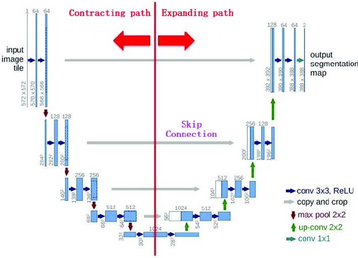
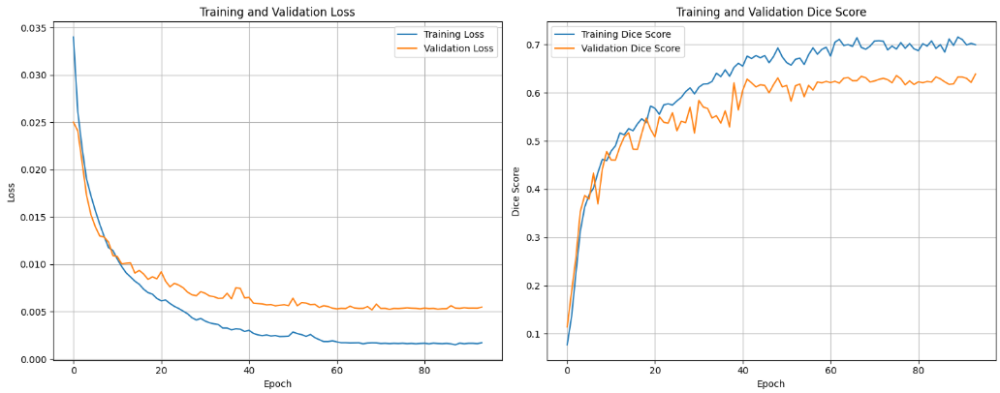
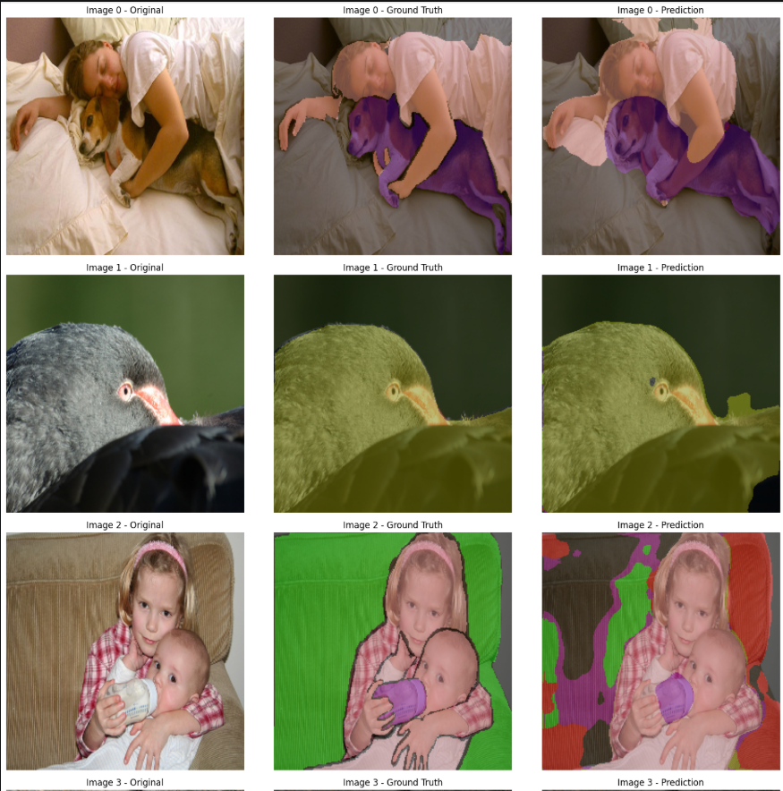
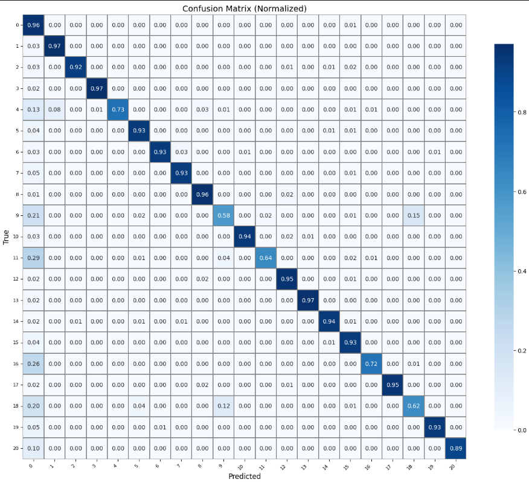

# UNet Semantic Segmentation


---

## What is UNet?

UNet is a fully convolutional neural network originally designed for biomedical image segmentation, introduced by Ronneberger et al. (2015). Its defining characteristic is a symmetric encoder–decoder architecture with skip connections that bridge corresponding encoder and decoder layers.

- The **encoder** (contracting path) progressively downsamples the input through convolution and pooling, capturing semantic context at multiple scales.
- The **decoder** (expanding path) upsamples the feature maps back to the original resolution using transposed convolutions or bilinear upsampling.
- **Skip connections** concatenate feature maps from the encoder directly into the decoder at each resolution level, preserving fine-grained spatial details that would otherwise be lost during downsampling.

The result is a network that simultaneously understands *what* is in the image (semantic context) and *where* it is (spatial precision) — making it exceptionally well-suited for dense pixel-level prediction tasks.




---
## PASCAL VOC 2012

The PASCAL VOC 2012 dataset is a standard benchmark dataset used for object detection, image classification, and semantic segmentation.

It contains about 11,500 images with pixel-level annotations for 21 classes (20 object categories + background), such as person, car, dog, bicycle, etc.

For semantic segmentation, each pixel in an image is labeled with its corresponding class, making it widely used to train and evaluate segmentation models.

--- 
## Backbone : `tu-convnext_base`

The encoder in this project replaces the vanilla UNet contracting path with a **ConvNeXt-Base** backbone.

**ConvNeXt** (Liu et al., 2022) is a pure convolutional network designed to match Vision Transformers in performance while retaining the efficiency and inductive biases of CNNs. Key design choices include:

| Feature | Detail |
|---|---|
| Stem | 4×4 non-overlapping convolution (like ViT patch embedding) |
| Depthwise Conv | 7×7 depthwise separable convolutions per stage |
| Normalization | LayerNorm instead of BatchNorm |
| Activation | GELU throughout |
| Inverted Bottleneck | Expands channels in the MLP block (ratio 4×) |
| Stochastic Depth | Regularization via random layer dropping during training |

Using `tu-convnext_base` as the UNet encoder provides **ImageNet-pretrained hierarchical features** at four scales, giving the decoder rich multi-scale representations to work from — significantly boosting convergence speed and segmentation quality over a vanilla encoder.

---

## Data Augmentation

Training data was augmented using the **Albumentations** library. The following pipeline was applied per epoch during training:

```python
train_transform = A.Compose([
    A.Resize(256, 256),
    A.HorizontalFlip(p=0.1),
    A.VerticalFlip(p=0.1),
    A.RandomBrightnessContrast(p=0.1),
    A.GaussNoise(std_range=(0.02, 0.08), p=0.3),
    A.Normalize(),
    ToTensorV2()
])
```

| Transform | Purpose |
|---|---|
| `Resize(256, 256)` | Standardize input resolution |
| `HorizontalFlip` | Mild spatial invariance (p=0.1) |
| `VerticalFlip` | Mild spatial invariance (p=0.1) |
| `RandomBrightnessContrast` | Robustness to lighting variation |
| `GaussNoise(std 0.02–0.08)` | Simulate sensor noise, prevent over-reliance on clean inputs |
| `Normalize` | Zero-mean, unit-variance normalisation (ImageNet stats) |
| `ToTensorV2` | Convert to PyTorch tensor format |


---

## Loss Function

The model was trained with a **combined Dice + Focal loss**:

$$\mathcal{L} = 0.4 \times \mathcal{L}_{\text{Dice}} + 0.6 \times \mathcal{L}_{\text{Focal}}$$

### Dice Loss

Dice Loss directly optimises the **Dice Similarity Coefficient (DSC)** — the same metric used for evaluation. It is defined as:

$$\mathcal{L}_{\text{Dice}} = 1 - \frac{2 \sum p_i g_i}{\sum p_i + \sum g_i}$$

where $p_i$ is the predicted probability and $g_i$ is the ground truth for pixel $i$.

Dice Loss is robust to **class imbalance** (common in segmentation where background dominates) because it normalises by the total number of positive predictions and ground truths, rather than treating all pixels equally.

### Focal Loss

Focal Loss is a modification of cross-entropy that down-weights easy negatives and focuses training on hard, misclassified examples:

$$\mathcal{L}_{\text{Focal}} = -\alpha_t (1 - p_t)^\gamma \log(p_t)$$

- $(1 - p_t)^\gamma$ is the **modulating factor** — when a sample is correctly classified with high confidence ($p_t \to 1$), the loss contribution is suppressed.
- $\gamma > 0$ controls the focusing strength (typically $\gamma = 2$).

The **0.4 / 0.6 weighting** prioritises Focal Loss for sharper boundary learning while retaining the overlap-optimising properties of Dice Loss.

The value of $\alpha_t$ was taken as 1 for all classes

---

## Evaluation Metric : Dice Score (Excluding Background)

The primary evaluation metric is the **Dice Similarity Coefficient**, computed **excluding the background class**:

$$\text{Dice} = \frac{2 \times |P \cap G|}{|P| + |G|}$$

- **Range**: 0 (no overlap) → 1 (perfect overlap)
- **Background exclusion**: Background pixels are trivially easy to predict correctly in most segmentation tasks and would inflate the score. Excluding it gives a more honest measure of how well the model segments the actual foreground classes of interest.

---

## Results

>


| Split | Loss | Dice Score |
|---|---|---|
| **Training** | 0.2295 | 0.7319 |
| **Validation** | 0.3348 | 0.6365 |

The ~0.095 gap between training and validation Dice is consistent with mild overfitting, which may be addressed with stronger augmentation or regularisation in future iterations. The validation Dice of ~0.636 reflects meaningful foreground segmentation performance.

---

## Validation Predictions




---

## Confusion Matrix





---


